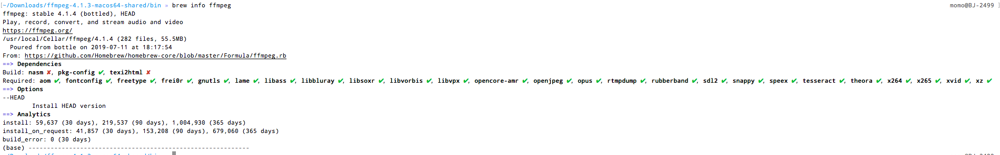
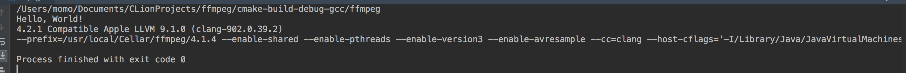

clone本工程之后在自己环境中需要修改cmakelist.txt中FFMPEG_DIR的路径才可以正常运行，具体操作参考如下：

#### Mac下clion引入ffmpeg库

- brew install ffmpeg 安装ffmpeg，等待安装完成
- brew info ffmpeg 查看版本以及路径


- clion新建c++工程
makefile文件如下，其中FFMPEG_DIR的路径需要按照上图自己的路径填写。

```
cmake_minimum_required(VERSION 3.12)
project(ffmpeg)

set(CMAKE_CXX_STANDARD 11)


set(FFMPEG_DIR /usr/local/Cellar/ffmpeg/4.1.4)
include_directories(${FFMPEG_DIR}/include/)
link_directories(${FFMPEG_DIR}/lib/)

add_executable(ffmpeg main.cpp)

target_link_libraries(
        ffmpeg
        avcodec
        avdevice
        avfilter
        avformat
        avresample
        avutil
        postproc
        swresample
        swscale
)
```

填写测试代码

```
#include <iostream>

extern "C" {
#include <libavcodec/avcodec.h>
#include <libavformat/avformat.h>
}
using namespace std;

int main() {
    cout << "Hello, World!" << std::endl;
    cout << __VERSION__ << endl;
    cout << avcodec_configuration() << endl;

    return 0;
}
```



